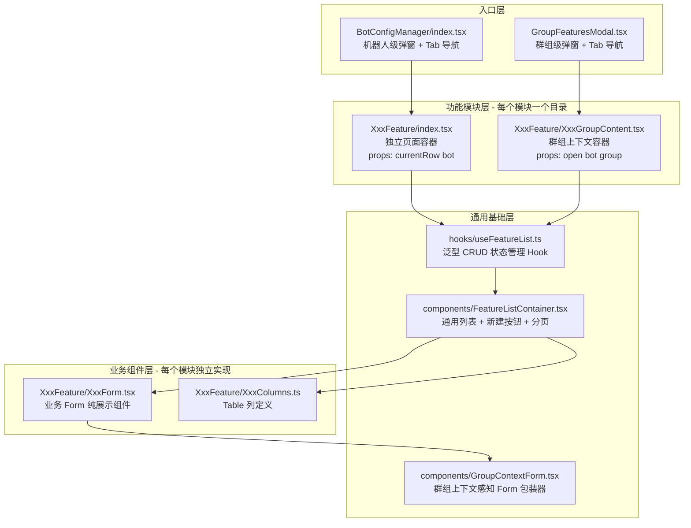
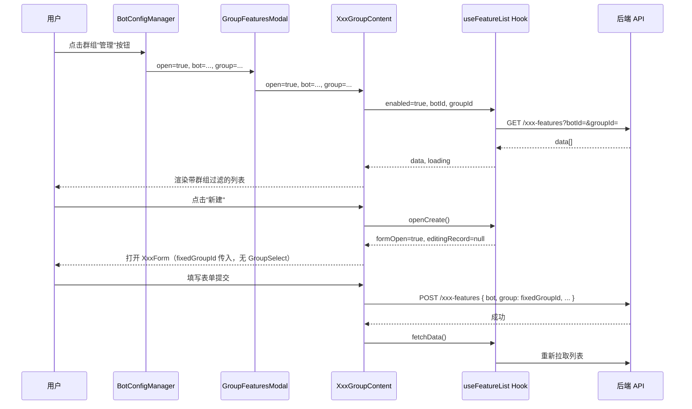
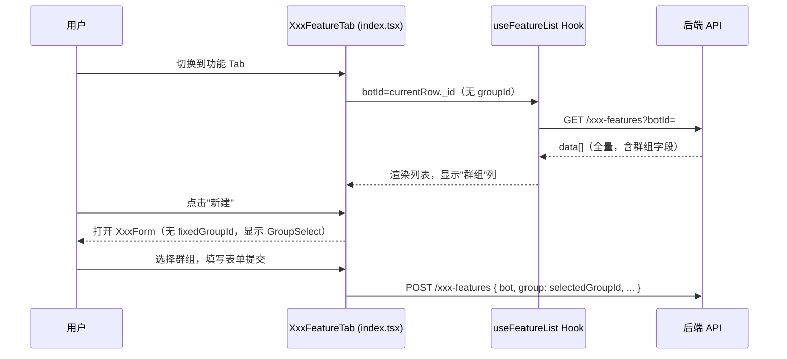

# 设计文档：BotConfigManager 多功能管理框架重构

## Overview

BotConfigManager 是 group-manager-admin 项目中管理 Telegram 机器人各类群组功能的核心模块。当前每个功能子模块（ReplyRule、GroupMessage、AuctionRule 等）都独立维护一套几乎相同的 Table + CRUD 状态管理代码，并在「群组上下文（GroupContent）」和「独立页面（index.tsx）」两种场景下分别复制一遍，导致代码量膨胀、维护成本高。

本次重构目标：设计一套通用的泛型 CRUD 容器层（`useFeatureList` Hook + `FeatureListContainer` 组件），统一 Form 组件接口，明确三种使用场景的职能边界，使新增功能模块只需编写数据列定义和业务 Form，无需再复制模板代码。

---

## Architecture



---

## 场景分析与职能边界

### 三种使用场景

| 场景 | 入口 | 组件 | 群组上下文 |
| --- | --- | --- | --- |
| 机器人级独立 Tab | `BotConfigManager` Tabs | `XxxFeature/index.tsx` | 无固定群组，展示全部数据 + GroupSelect |
| 群组功能弹窗 Tab | `GroupFeaturesModal` Tabs | `XxxGroupContent.tsx` | 固定 bot + group，不显示 GroupSelect |
| （历史）群组弹窗 | `*GroupModal.tsx` | `AuctionRuleGroupModal` 等 | **废弃**，功能与 GroupContent 完全重复 |

**结论：`*GroupModal.tsx` 系列组件可全部删除**，其唯一作用是套了一层 `Modal` 壳，而该壳已由 `GroupFeaturesModal` 统一提供。

### GroupContent vs index.tsx 的唯一区别

```typescript
// index.tsx（独立页面）：
// - fetchData 只传 botId，不传 groupId
// - Form 显示 GroupSelect 供用户选择群组
// - props: { currentRow: BotRecord }

// *GroupContent.tsx（群组上下文）：
// - fetchData 同时传 botId + groupId
// - Form 接收 fixedGroupId，隐藏 GroupSelect
// - props: { open: boolean; bot: BotRecord; group: GroupRecord }
```

这个区别可以用一个统一 Hook + 条件参数来消除重复实现。

---

## Components and Interfaces

### 1. `useFeatureList<T>` Hook

**职责**：封装所有功能模块共用的列表状态管理逻辑（数据获取、删除、状态切换、新建/编辑弹窗控制）。

```typescript
// src/pages/Authorization/components/BotConfigManager/hooks/useFeatureList.ts

interface UseFeatureListOptions<T> {
  /** API 路径，如 '/reply-rules' */
  apiPath: string;
  /** 机器人 ID（必须） */
  botId: string | undefined;
  /** 群组 ID（传入时自动作为过滤条件） */
  groupId?: string | undefined;
  /** 触发加载的依赖开关（对应 GroupContent 的 open prop） */
  enabled?: boolean;
  /** 删除时使用的请求方式，默认 removeItem ids 批量删除 */
  deleteMode?: 'batch' | 'single';
  /** 状态字段名，默认 'isOnline' */
  statusField?: string;
}

interface UseFeatureListReturn<T> {
  data: T[];
  loading: boolean;
  formOpen: boolean;
  editingRecord: T | null;
  fetchData: () => Promise<void>;
  openCreate: () => void;
  openEdit: (record: T) => void;
  closeForm: () => void;
  handleDelete: (id: string) => Promise<void>;
  handleStatusChange: (record: T, value: boolean) => Promise<void>;
}

function useFeatureList<T extends { _id: string }>(
  options: UseFeatureListOptions<T>,
): UseFeatureListReturn<T>;
```

**内部实现要点**：

- `fetchData` 根据 `groupId` 是否存在，自动在请求参数中附加 `groupId`
- `handleDelete` 支持 `batch` 模式（`removeItem`）和 `single` 模式（`request DELETE`）
- `handleStatusChange` 通用化为 `updateItem(\`${apiPath}/${id}\`, { [statusField]: value })`
- `enabled` 为 `false` 时不执行 fetch（用于 GroupContent 的 `open` 控制）

### 2. `FeatureListContainer<T>` 组件

**职责**：提供统一的列表页面外壳（新建按钮 + Table + 加载状态）。

```typescript
// src/pages/Authorization/components/BotConfigManager/components/FeatureListContainer.tsx

interface FeatureListContainerProps<T> {
  /** 列表数据 */
  data: T[];
  /** 加载状态 */
  loading: boolean;
  /** Table 列定义 */
  columns: ColumnType<T>[];
  /** 新建按钮文字，默认"新建" */
  createButtonText?: string;
  /** 点击新建按钮回调 */
  onCreateClick: () => void;
  /** 表格 rowKey，默认 '_id' */
  rowKey?: string;
  /** 额外的头部元素（如 Alert 提示） */
  headerExtra?: React.ReactNode;
  /** 分页配置，false 则不显示 */
  pagination?: false | TablePaginationConfig;
  /** 滚动配置 */
  scroll?: TableProps<T>['scroll'];
}

function FeatureListContainer<T>(props: FeatureListContainerProps<T>): JSX.Element;
```

### 3. `GroupContextForm` 包装器

**职责**：为 Form 弹窗提供群组上下文感知能力，统一弹窗的 open/close 行为。

```typescript
// src/pages/Authorization/components/BotConfigManager/components/GroupContextForm.tsx

interface GroupContextFormProps {
  /** 弹窗显示状态 */
  open: boolean;
  /** 关闭回调 */
  onClose: () => void;
  /** 弹窗标题 */
  title: string;
  /** 固定的群组 ID（来自群组上下文场景） */
  fixedGroupId?: string;
  /** 弹窗宽度 */
  width?: number | string;
  /** Form 内容（接收 fixedGroupId 并决定是否渲染 GroupSelect） */
  children: React.ReactNode;
}
```

---

## 功能模块层设计规范

### 文件职能分工（每个模块目录）

```
XxxFeature/
├── index.tsx            # 机器人级独立容器（使用 useFeatureList，不传 groupId）
├── XxxGroupContent.tsx  # 群组上下文容器（使用 useFeatureList，传 groupId）
├── XxxForm.tsx          # 业务 Form（纯展示 + 提交逻辑，接收 editingRecord/fixedGroupId）
└── XxxColumns.tsx       # Table 列定义（纯函数，接收操作回调）
```

**废弃文件**：`*GroupModal.tsx`（如 `AuctionRuleGroupModal.tsx`、`LotteryRuleGroupModal.tsx` 等）— 全部删除，职责由 `GroupFeaturesModal` + `XxxGroupContent` 接管。

**废弃文件**：`*GroupSelect.tsx`（如 `BotGroupSelect.tsx`、`LotteryGroupSelect.tsx`）— 整合进 `GroupContextForm` 或 Form 内部条件渲染。

### index.tsx 标准模板

```typescript
// 独立页面场景：bot 级别，不固定 group
const XxxFeatureTab: React.FC<{ currentRow: any; onDataChange?: () => void }> = ({
  currentRow,
}) => {
  const {
    data,
    loading,
    formOpen,
    editingRecord,
    openCreate,
    openEdit,
    closeForm,
    handleDelete,
    handleStatusChange,
    fetchData,
  } = useFeatureList<XxxRecord>({
    apiPath: '/xxx-features',
    botId: currentRow?._id,
    // 不传 groupId → fetchData 只用 botId 过滤
  });

  const columns = createXxxColumns({
    onEdit: openEdit,
    onDelete: handleDelete,
    onStatusChange: handleStatusChange,
  });

  return (
    <>
      <FeatureListContainer
        data={data}
        loading={loading}
        columns={columns}
        onCreateClick={openCreate}
      />
      <XxxForm
        open={formOpen}
        onClose={closeForm}
        currentRow={currentRow} // bot 信息
        editingRecord={editingRecord}
        onSuccess={fetchData}
        // 不传 fixedGroupId → Form 内显示 GroupSelect
      />
    </>
  );
};
```

### XxxGroupContent.tsx 标准模板

```typescript
// 群组上下文场景：bot + group 都固定
const XxxGroupContent: React.FC<{ open: boolean; bot: any; group: any }> = ({
  open,
  bot,
  group,
}) => {
  const {
    data,
    loading,
    formOpen,
    editingRecord,
    openCreate,
    openEdit,
    closeForm,
    handleDelete,
    handleStatusChange,
    fetchData,
  } = useFeatureList<XxxRecord>({
    apiPath: '/xxx-features',
    botId: bot?._id,
    groupId: group?._id, // 传入 groupId → fetchData 自动附加过滤条件
    enabled: open, // 仅在弹窗打开时触发加载
  });

  const columns = createXxxColumns({
    onEdit: openEdit,
    onDelete: handleDelete,
    onStatusChange: handleStatusChange,
  });

  return (
    <>
      <FeatureListContainer
        data={data}
        loading={loading}
        columns={columns}
        onCreateClick={openCreate}
      />
      <XxxForm
        open={formOpen}
        onClose={closeForm}
        currentRow={bot}
        editingRecord={editingRecord}
        onSuccess={fetchData}
        fixedGroupId={group?._id} // 传入 fixedGroupId → Form 内隐藏 GroupSelect
      />
    </>
  );
};
```

---

## Form 组件统一接口规范

### 标准 Form Props 接口

所有功能模块的 Form 组件必须实现以下接口：

```typescript
interface StandardFormProps<TRecord = any> {
  /** 弹窗开关 */
  open: boolean;
  /** 关闭弹窗回调 */
  onClose: () => void;
  /** 当前机器人记录（用于新建时关联 bot） */
  currentRow: any;
  /** 编辑时传入现有记录，不传则为新建模式 */
  editingRecord?: TRecord | null;
  /** 操作成功后回调（通常是刷新列表） */
  onSuccess: () => void;
  /**
   * 固定的群组 ID（来自群组上下文场景）
   * - 传入时：Form 不显示 GroupSelect，直接使用该值
   * - 不传时：Form 内显示 GroupSelect 供用户选择
   */
  fixedGroupId?: string;
}
```

### 新建/编辑模式判断

```typescript
// Form 内部统一用以下方式判断模式
const isEdit = !!editingRecord?._id;

// title 展示
const title = isEdit ? `编辑 ${featureName}` : `新建 ${featureName}`;

// 提交时的 API 调用
if (isEdit) {
  await updateItem(`${apiPath}/${editingRecord._id}`, payload);
} else {
  await addItem(apiPath, { ...payload, bot: currentRow._id, group: fixedGroupId });
}
```

### 弹窗关闭时的数据清理

```typescript
// Form 组件统一在 onClose 之前重置内部状态
const handleClose = () => {
  form.resetFields();
  setContent(''); // 富文本
  setMedias([]); // 媒体文件
  setMenus([]); // 菜单配置
  onClose();
};
```

---

## 主流程时序图

### 场景 A：群组管理弹窗流程



### 场景 B：机器人级独立页面流程



---

## Data Models

```typescript
// 群组上下文的核心 props 组合
interface GroupContext {
  /** 机器人记录 */
  bot: BotRecord;
  /** 群组记录（可选，不传则为机器人级视图） */
  group?: GroupRecord;
}

// 功能记录的通用基础字段
interface FeatureBaseRecord {
  _id: string;
  bot: string | BotRecord; // 关联机器人
  group?: string | GroupRecord; // 关联群组（可选）
  isOnline: boolean; // 启用/禁用状态
  createdAt: string;
  updatedAt: string;
}

// 机器人记录（简化）
interface BotRecord {
  _id: string;
  botName?: string;
  userName?: string;
  groups?: GroupRecord[];
}

// 群组记录（简化）
interface GroupRecord {
  _id: string;
  title: string;
  username?: string;
  type: 'group' | 'supergroup' | 'channel';
}
```

---

## 特殊场景处理

### CheckinRule：Card 布局而非 Table

CheckinRule 每个群组只有「每日签到」和「初次签到」两条规则，使用 Card 布局比 Table 更合适。该模块不使用 `FeatureListContainer`，保持独立的 Card 渲染逻辑，但仍使用 `useFeatureList` 管理状态。

### AuctionRule：额外的出价记录弹窗

AuctionRule 存在「出价记录」子弹窗，该逻辑在 `columns` 的操作列中维护，不影响通用容器层。

### GroupMessage：立即发送 vs 定时发送

GroupMessage 的 Form 中有发送类型差异（立即 vs 定时），该差异完全封装在 `GroupMessageForm.tsx` 内部，不影响容器层的通用接口。

---

## 迁移路线图

### 阶段一：建立通用基础层（不破坏现有功能）

1. 创建 `hooks/useFeatureList.ts`
2. 创建 `components/FeatureListContainer.tsx`
3. 创建 `components/GroupContextForm.tsx`

### 阶段二：逐模块迁移（最高价值优先）

按代码冗余程度排序，建议迁移顺序：

1. `GroupMessage`（index + GroupContent 模式最标准，适合作为参考实现）
2. `ReplyRule`
3. `AdRemoval`
4. `GroupWelcome`
5. `GroupVerify`
6. `SpeechStatistics`
7. `LotteryRule`
8. `AuctionRule`
9. `CheckinRule`（特殊 Card 布局，最后处理，改成统一布局）

### 阶段三：清理废弃文件

删除所有 `*GroupModal.tsx` 和 `*GroupSelect.tsx` 文件（共约 10 个）。

---

## Correctness Properties

_属性（Property）是一种在所有合法输入下都应成立的系统行为断言，作为连接人类可读规范与机器可验证正确性的桥梁。_

### 属性 1：群组上下文隔离

_对于任意_ `GroupContent` 组件实例，当传入 `groupId` 时，所有通过该实例加载和创建的数据记录，其 `group` 字段必须等于传入的 `groupId`，不得出现跨群组数据污染。

**验证：需求 5.3、5.6**

### 属性 2：Form 新建 vs 编辑路径互斥

_对于任意_ 功能模块的 Form 组件，当 `editingRecord` 不为 null 且包含 `_id` 时，提交操作必须调用 `updateItem`；当 `editingRecord` 为 null 时，提交操作必须调用 `addItem`。这两条路径互斥且完备，不存在同时调用两者或均不调用的情况。

**验证：需求 4.2、4.3**

### 属性 3：`useFeatureList` 的 enabled 门控

_对于任意_ 使用 `useFeatureList` 的 GroupContent 组件，当 `enabled` 为 `false` 时，`fetchData` 不得发起任何 API 请求；当 `enabled` 从 `false` 切换为 `true` 时，必须恰好触发一次 `fetchData`。

**验证：需求 1.4、1.5**

### 属性 4：写操作后的状态最终一致性

_对于任意_ `handleDelete` 或 `handleStatusChange` 操作，操作成功后必须调用 `fetchData` 重新拉取列表，确保本地状态与服务端状态最终一致。

**验证：需求 1.9、1.11**

### 属性 5：fixedGroupId 对 GroupSelect 渲染的单调控制

_对于任意_ Form 组件实例，`fixedGroupId` 已传入时，GroupSelect 选择器不应渲染为可交互状态；`fixedGroupId` 未传入时，GroupSelect 必须渲染为可交互状态。这两个条件互斥且完备。

**验证：需求 4.4、4.5**

### 属性 6：fetchData 请求参数的 groupId 隔离

_对于任意_ `useFeatureList` 实例，当传入 `groupId` 时，所有 `fetchData` 请求的参数中必须包含 `groupId`；当未传入 `groupId` 时，所有 `fetchData` 请求的参数中不得包含 `groupId`。

**验证：需求 1.2、1.3**

### 属性 7：Form 关闭后状态归零

_对于任意_ Form 组件实例，执行"打开 → 填写任意内容 → 关闭"的完整操作序列后，再次打开该 Form 时，所有表单字段及内部状态（富文本、媒体文件、菜单配置等）必须恢复为初始空值，不得残留上一次的输入内容。

**验证：需求 4.7**

---

## Error Handling

### 错误场景 1：API 请求失败（fetchData）

**条件**：`fetchData` 发起的 GET 请求返回非 2xx 状态码或网络中断。

**响应**：将 `loading` 置为 `false`，`data` 保持上一次成功的值或空数组；通过全局消息组件（`message.error`）展示错误提示。

**恢复**：用户可手动触发重新加载，或通过 `enabled` 状态变化重新触发 `fetchData`。

### 错误场景 2：删除操作失败（handleDelete）

**条件**：`removeItem` / DELETE 请求返回失败。

**响应**：不修改本地 `data`，通过 `message.error` 展示失败原因；不调用 `fetchData`（避免假刷新）。

**恢复**：用户可重试删除操作。

### 错误场景 3：状态切换失败（handleStatusChange）

**条件**：`updateItem` 请求返回失败。

**响应**：回滚 UI 上的 Switch 状态（恢复到原始值），通过 `message.error` 展示失败原因；不调用 `fetchData`。

**恢复**：用户可重新切换 Switch 状态重试。

### 错误场景 4：Form 提交失败

**条件**：`addItem` 或 `updateItem` 请求返回失败（如字段校验错误、服务端异常）。

**响应**：弹窗保持打开状态，不调用 `onSuccess`；通过 `message.error` 展示服务端返回的错误信息。

**恢复**：用户修正表单后可重新提交。

### 错误场景 5：数据记录群组字段异常

**条件**：`fetchData` 返回的记录中，某条记录的 `group` 字段不等于传入的 `groupId`（跨群组数据污染）。

**响应**：在 `XxxGroupContent` 的渲染层过滤掉该记录，不展示在列表中；可选：在开发环境输出 `console.warn`。

**恢复**：属于数据一致性问题，需后端修复；前端通过过滤防御。

---

## Testing Strategy

### 单元测试策略

**`useFeatureList` Hook**：

- 使用 `@testing-library/react` 的 `renderHook` 进行测试
- 测试 `enabled=false` 时不触发 API 请求
- 测试 `enabled` 从 `false` 切换为 `true` 时恰好触发一次 `fetchData`
- 测试 `groupId` 有无时 `fetchData` 请求参数的差异
- 测试 `openCreate` / `openEdit` / `closeForm` 的状态转换
- 测试 `handleDelete` 成功后调用 `fetchData`，失败后不调用
- 测试 `handleStatusChange` 成功后调用 `fetchData`

**`FeatureListContainer` 组件**：

- 渲染测试：验证新建按钮文字、表格列、加载状态显示
- 交互测试：点击新建按钮触发 `onCreateClick`
- 条件渲染：`pagination=false` 时不渲染分页控件；`headerExtra` 传入时正确渲染

**`GroupContextForm` 组件**：

- `open=true` 时弹窗可见，`open=false` 时隐藏
- 关闭操作触发 `onClose`

### 基于属性的测试策略（Property-Based Testing）

**测试库**：`fast-check`（TypeScript/JavaScript 项目标准选择）

**属性 2：Form 新建 vs 编辑路径互斥**

```typescript
// 对任意 editingRecord（含 _id 或为 null），验证 API 调用路径互斥
fc.assert(
  fc.property(fc.option(fc.record({ _id: fc.string({ minLength: 1 }) })), (editingRecord) => {
    const isEdit = !!editingRecord?._id;
    // updateItem 与 addItem 恰好调用其中一个
    expect(isEdit ? updateItemCalled : addItemCalled).toBe(true);
    expect(isEdit ? addItemCalled : updateItemCalled).toBe(false);
  }),
);
```

**属性 5：fixedGroupId 对 GroupSelect 渲染的单调控制**

```typescript
fc.assert(fc.property(
  fc.option(fc.string({ minLength: 1 })),
  (fixedGroupId) => {
    render(<XxxForm fixedGroupId={fixedGroupId} ... />);
    if (fixedGroupId) {
      expect(screen.queryByRole('combobox', { name: /群组/ })).not.toBeInTheDocument();
    } else {
      expect(screen.getByRole('combobox', { name: /群组/ })).toBeInTheDocument();
    }
  }
));
```

**属性 6：fetchData 请求参数的 groupId 隔离**

```typescript
fc.assert(
  fc.property(fc.option(fc.string({ minLength: 1 })), async (groupId) => {
    const { result } = renderHook(() =>
      useFeatureList({ apiPath: '/test', botId: 'bot1', groupId }),
    );
    await act(() => result.current.fetchData());
    const lastCall = mockRequest.mock.calls.at(-1)[0];
    if (groupId) {
      expect(lastCall.params).toHaveProperty('groupId', groupId);
    } else {
      expect(lastCall.params).not.toHaveProperty('groupId');
    }
  }),
);
```

### 集成测试策略

**场景 A：群组弹窗完整流程**

- 模拟 `GroupFeaturesModal` 打开 → `XxxGroupContent` 挂载 → API 请求触发 → 列表渲染
- 验证新建 → 表单填写 → 提交 → 列表刷新的完整链路
- 验证 `fixedGroupId` 在整个链路中正确传递

**场景 B：机器人级页面完整流程**

- 验证 `index.tsx` 挂载时以 `botId` 触发 API 请求（无 `groupId`）
- 验证新建弹窗中 GroupSelect 可见且可操作

**迁移兼容性测试**

- 对每个已迁移模块，验证迁移前后 UI 行为一致（快照测试 + 交互测试）
